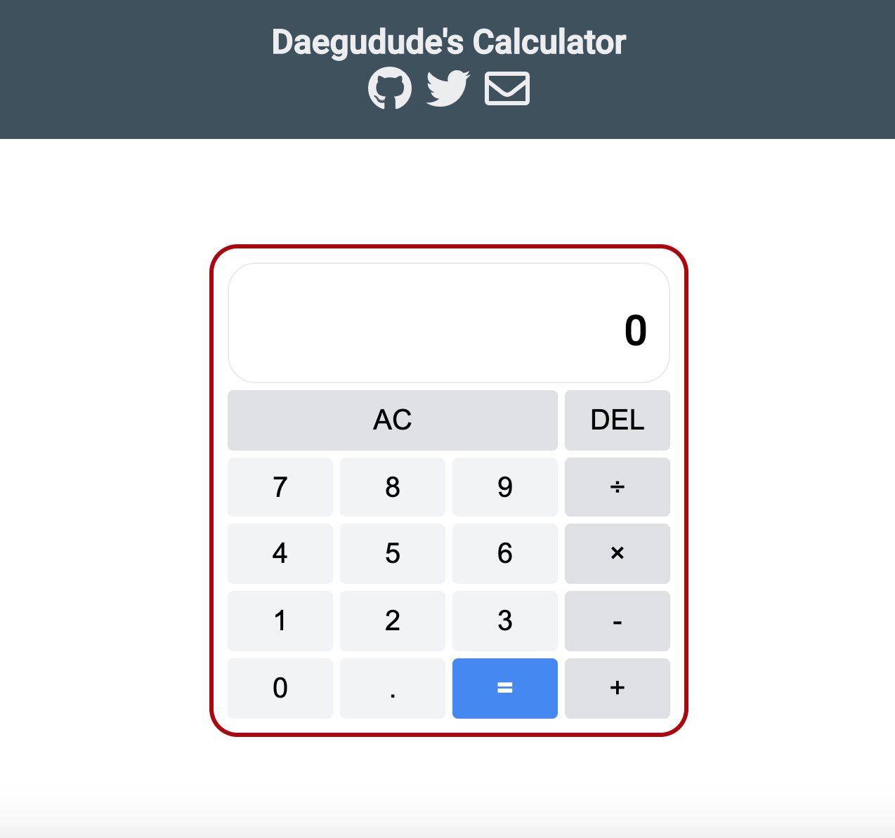

## The Odin Project - Calculator

In this project, we are going to make a calculator that can perform basic
operations. Besides from making this thing work, in this project, there is one 
particular thing that I really want to practice. [PROBLEM SOLVING](https://www.theodinproject.com/courses/javascript/lessons/problem-solving-javascript).

I will follow this problem solving skills before I tackle any of the problems that I will have encountered.

## Preview

Here's the [link](https://daegudude.github.io/calculator-redo/) to my calculator. It's not really design friendly and have some minor bugs, so if you can tell me that I'd appreciate it.

## Review

### Problem Solving

1. Did I follow the problem solving process?

    Yes I did follow it.

2. How did problem solving technique help you?

    The effect of the problem solving was more than I could have expected. By having a clear plan(algorithm) aside, I could just look up sub-problems that I should look up.

3. Things to improve on Problem Solving

    - Can't sort the problems in proper order. For example if I need to fix some layout of css, I can't really clarify what I should fix first to fix efficiently.

    - Can't make speific algorithms. Even if I understood the problems clearly, I can't translate that problem into specific action order to solve it

## Things I Have Learned

1. Better than yesterday problem solving skills
2. Better than yesterday grit(Finish what you've started)

